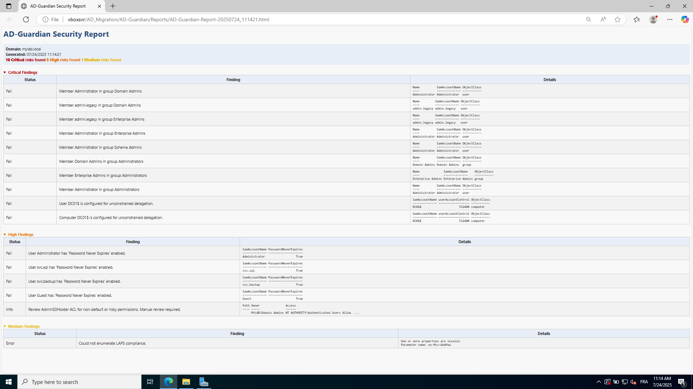

# AD-Guardian

Ultimate PowerShell AD Security Tool

## Overview
AD-Guardian is a modular, extensible PowerShell toolkit for auditing and remediating Active Directory security issues. It features a professional HTML reporting engine, interactive remediation, and is easy to extend with new modules.


## Features
- Modular audit and remediation modules
- Configuration via `config.json`
- Professional HTML reports
- Interactive menu system
- Safe, read-only audits by default

## Directory Structure
```
AD-Guardian.ps1
config.json
/modules
  /audits
  /remediation
/Reports
/tests
```

## Setup
1. Ensure you have the Active Directory PowerShell module installed (`RSAT-AD-PowerShell`).
2. Clone or copy the repository to your management workstation.
3. Edit `config.json` to customize privileged groups, thresholds, and report paths as needed.

## Usage
1. Open PowerShell as an administrator.
2. Navigate to the project directory.
3. Run the tool:
   ```powershell
   .\AD-Guardian.ps1
   ```
4. Follow the interactive menu to run audits or remediation.
## Report

After running audits or remediation, **AD-Guardian** generates a professional HTML report summarizing the findings and any actions performed.  
By default, the report files are saved in the `/Reports` directory inside the project folder.  

Open the generated `.html` file in any modern web browser to review the detailed results and export the report for documentation or sharing.

## Extending
- Add new audit modules to `/modules/audits/`.
- Add new remediation modules to `/modules/remediation/`.
- Each module should be a PowerShell script exporting a function as described in the documentation.

## Testing
- Pester tests for modules are located in `/tests`.

## Requirements
- Windows PowerShell 5.1+
- Active Directory PowerShell module

## License
MIT 
